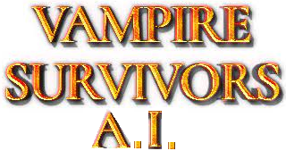

# VampireSurvivors A.I.

##### VampireSurvivors A.I.는 최근 유행하는 로그라이크 장르게임 중 하나인 Vampire Survivors에 실전성 있는 Deep-RL을 접목하여 설계한 강화학습 프로젝트이다.
##### 프로젝트에 강화학습을 실제로 적용하는 것은 생각보다 까다로운데, 해당 프로젝트의 setting을 어떻게 구성할지, 또 reward는 어떻게 정할지에 따라 해당 강화학습 프로젝트의 학습 성능이 크게 갈리는 경향이 있기 때문이다.
##### 그래서 위 게임을 클리어하기 위해선 두가지 과제를 해결해야 했는데, 게임 내 화면에 나오는 몹들에 대한 agent의 방향키 조절,그리고 레벨업 상황에서 아이템 선택을 정하는 것이다. 

#### *Read this in other languages: [to English](README.eng.md)

## Architecture
<iframe frameborder="0" style="width:100%;height:1024px;" src="https://viewer.diagrams.net/?tags=%7B%7D&highlight=0000ff&edit=_blank&layers=1&nav=1&title=#R7Vtbc5s4FP41nuk%2BbAZJ5uLHxnXa7qRpZ52220cZZJsGI48s3%2FbXrwARQMI2Sbh1GzKTQUcSupxzPn3ngAdovDq8Z3i9%2FEQ9Egyg4R0G6N0AwtHIEP8jwTERQMtMBAvme4kIZIKp%2Fy%2BRQtlvsfU9sik05JQG3F8XhS4NQ%2BLyggwzRvfFZnMaFEdd4wXRBFMXB6n0yszk332PL6UcWKOs4gPxF0s5uAOtpGKG3YcFo9tQjhjSkCQ1K5w%2BRq5ys8Qe3edEaDJAY0YpT%2B5WhzEJon1N9yztx4%2FpRAfoeslXgSgAcRtX35zoDKp0FutiJOT54U497%2Ft%2By8Hs5%2FrB9nfu8C80ssDoTzt5yg4H23QQdVTiia2WRcr4ki5oiINJJr2Od49EwxiilLW5pXQtJ%2FuTcH6UdoO3nBaXMqchv8ErP4jM73br%2Bh4WcxjTcEPjAaJ62Rk4pUtPN4tumUvOrDc1TswWhJ9pJ40jWntuALmx7wldEc6OogEjAeb%2BrmicWFrz4rFdphZxIzXzBC0BuwutkIPP%2F4m6C%2BdKSj9yNe8O8slx4SgL%2FdMk7JcmNX%2BbhDufiaeH%2FM0smoeL13zLyB%2Baxov63C99TqZrHO%2FRXoC64lF%2BEIxpQFncF3mYOHNXyDec0QeSq7Fch8zmJZq5pMmTmtsRxsnh7F7LWis9duSpA9LyPkNwZEnZMgfeqax29UCzW0eD1T1NbDs75twzKv7I12Xd4lL7HgqreijolYumxKArG7B%2FSxtA%2FbIBDaZvCI5gWQgnoSvoMxtAKxArup5Fd4vo7s2UCy4pjEBs5d3dSwH8iSpSAH8%2Bn0O3FPA9a2aZVj0AboMigCNUAuCwBMBHTQG4838lSs919ee7rlXRdUHt8C27fqG%2BmPOjsQFkKNaWntbpM5Kpym6ZIb1lDB9zzdZRg41mao8zfQG7QxpudGGP7cF7ZRvpFwu3NDX5c1G%2BJbs4LfJ1rWP3kq5m203juE2AZxK7DLdHlo1wTbgNgK0wb1sHbljGvIHRFHKDTmjXs2EYFEA4w%2BTaYRhUDXTr97ETOGwieAXzV9GUoGIhT0blE8MOFZtNI8Obqh2AYSpWmsyh3iNAj%2FCnk9vJ%2BP7j5ztBFPEqwovkv15UCOXXtYc5iT3b5QIHuiSUJL7KgAlZaIS8moAJVmCUwGkVmGC3nDLHKDN%2B%2BauGgylGXY4H7UbA7MmgA4yzGHK5g4kuoNSjhZd3aAil9AD30%2Fh%2BKiTfBFR9%2FrtTqJmb0Z9slwea%2BCpNYsZXXRCkaNAqoUZGmzEtMDVl3bMt0XQkFsiLiihuVPxmq7jbUoQDfxGKoiu2jQj5dbRdvouDt7Ji5XterLoyzRdtozYweYHKoKPrrIzNoqZUhvSXdz3NQ%2FT%2FzIBVCTAc1X1mvIw36Ezwy9LXWd6NeLwR4CPpluDNxeU4TRM8CyrgWsLvYKsZQ9TxK58%2BvltNs%2FEXXQ4N%2B%2BVyev7tW3zbG6erwYVGKj%2Fp3oX071z6nLpJX7E1n0JPo5gOjq7yaMNWUiKO2VCyRo1qHPXjJHVijnmufTNREOr4Te%2BzWNrTbLfFM6OqrfftzNA%2FgUtC4b4cGQpPcz0yc2bNJ%2BL6R9RGv4q3tuh0bZ0byLhycpddsA1gqIH0iWOkLuBOl109tIKd%2Bmw3sZVT9lKvXZfV04wuDV3MNW38trkre1hUml3yDWSrqathJ2S%2B3zBbP2U5QZsNcB5nK75brY0gDzX%2FvRhPt4y0NbigGlD3ADd1TvqKm4rSlADT7jrlP9TTvdjlvtiDV6Wd%2Bl4UGGbXWtMZSnL7qrPU0RxVZ8PGdCaK2a%2FpkkMs%2B7kimvwH"/>

## PPO
#### ● 방향키 조절에 대한 알고리즘은 해당 게임이 Grid World 라는 것을 감안하여 레벨업, 상자 획득과 기본 시간 생존을 양수 값으로 설정하였고, 죽는 화면 근처 행동값에 대한 보상에 음수 값을 추가 하였다.
#### ● Grid World를 탐색하는 알고리즘 중에 2017년도에 공개된  PPO(Proximal Policy Optimization)는 이전 행동과 현재 행동을 비교하여 loss값을 구성하는 알고리즘으로 Grid World 학습에 낮은 Episode를 적용해도 뛰어난 학습 성능을 보여줬다.
#### ● 위 게임의 특성상 training 1 episode에 시작할때 2~3분정도가 최저치이고 20~30분 정도가 최대치이다. 
#### ● 그렇기에 최소한의 episode로 높은 효율을 내는 알고리즘이 필요했고 model based 중 비교적 덜 최신이긴 하지만 뛰어난 성능을 갖춘 PPO를 도입했다.
#### 또, LSTM을 추가하여 동기식 A2C 모델로 구성해 더 나은 시간적 데이터에 대한 반응을 갖게 설계했다.

## MCTS
#### ● 또한 이 게임 플레이 도중 다양한 아이템을 선택하게 되는데 무작위의 경우의 수  에서  의 각 횟수의 선택지에 에피소드 최대 90이라는 선택지가 있기 때문에 매우 큰 수의 선택 그래프가 필요했고 MCTS를 이용한 근사를 사용하는 것이 정답이라고 생각했다.
#### ● 그렇기에 아이템 선택과정에 MCTS를 적용하고, MCTS를 numpy를 응용해 MCTS_MAP[MAX_LEVEL_UP][ITEM_SELECTION] 깊이의 벡터로 표현했다.
#### ● 또한 해당 프로젝트를 수행하던 중, MCTS 의 아이템 선택에 따른 GridWorld의 반응이 있다면 어떨까라는 아이디어를 구상하게 되었고 [AlphaStar](_https://www.nature.com/articles/s41586-019-1724-z) 의 모델 Architecture에서 Action을 결정할때 관련성 있는 데이터를 각자 MLP를 지나게 한뒤 다시 neural network를 활용해 산출해 내는 방식을 보았고 이를 채택해 MCTS의벡터 값을  MLP가 한번 처리해주어 나온 평가값을 MLP 레이어에 지나치게 해주었다.

### RL 알고리즘들의 실제 접목에 부딪쳤었던 요소들
##### 아무래도 가장 큰 요소는 데이터 전처리 과정에 있었던 것 같다. 초기 구성 당시에 해당 screenshot을 내보낸 image 값을 opencv의 template 을 활용하여 보석이나 상자, 장애물과 보스몹들에 대한 보상을 적용하려 했는데, 무려 시간이 4초가량이나 걸렸던 것이다! 반응을 하긴 하지만 해당 agent가 60fps로 진행되는 게임에서 240 frame이라는 어마어마한 states를 손실한다는건 RL모델의 학습 이전에 해당 게임이라는 문제를 풀 수 없을 정도의 차이라서 눈물을 머금고 해당 데이터와 함수들을 날렸다.
##### 물론 최근에 나온 [YOLOX](https://github.com/Megvii-BaseDetection/YOLOX) 라던지 고성능의 Obejct Detection Model을 사용하면 극히 낮은 시간으로 높은 정확도를 가진 이미지 인식을 해 실제 Grid-World의 모습을 구현할 수 있었을거라 생각한다. 그러나 데이터 셋을 모으는 과정이나 어디까지나 설날 기간 스낵 프로젝트( ~~결국 [야크털깎이](https://www.lesstif.com/software-engineering/yak-shaving-29590364.html) 가 되어버렸다!~~)였던 이 프로젝트에는 그런 시간자원을 쏟아부을 가치가 부족하다고 느껴 남겨둔다.
##### 그러니 게임류 RL 프로젝트 수행에 있어서는 해당 settings의 데이터를 모두 사용할 수 있는 API(Starcraft,Minecraft) 라던지, 훌륭한 데이터 수집 노가다를 겪어야만 한다는게 기정사실이니 절대 토이 프로젝트로 삼지 말길 바란다.

### 프로젝트 체험해보기
#### 현재 학습중
